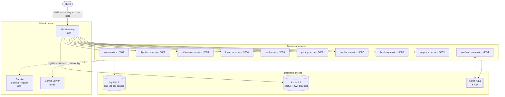
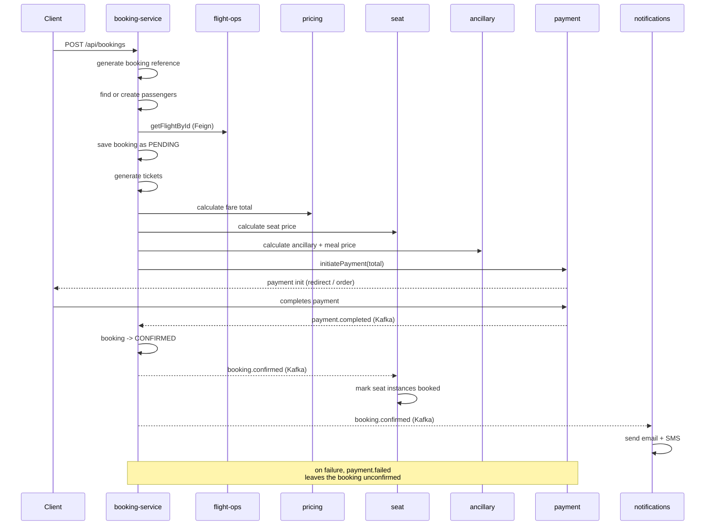

# Airline GDS — Microservices Platform

A Global Distribution System for airline retail, built as a Spring Boot microservice platform: airline and fleet setup, schedules and flight instances, seat maps and seat inventory, fares and baggage rules, ancillaries and meals, then booking, payment and ticketing — wired together with Eureka discovery, an API gateway, OpenFeign, and Kafka events.

**10 business services · 3 infrastructure services · 1 shared library · a MySQL database per service.**

---

## Table of contents

- [Architecture](#architecture)
- [Services](#services)
- [Tech stack](#tech-stack)
- [How requests flow](#how-requests-flow)
- [The booking saga](#the-booking-saga)
- [Events](#events)
- [Running it](#running-it)
- [API surface](#api-surface)
- [Project layout](#project-layout)
- [Configuration](#configuration)
- [Notes and known rough edges](#notes-and-known-rough-edges)

---

## Architecture



Every service registers with **Eureka** and pulls its configuration from the **Config Server**, which reads from an external Git repository. Only the **API Gateway** is published to the outside world; everything else is reachable solely inside the Docker network.

## Services

| Service | Port | Owns |
| --- | --- | --- |
| **user-service** | 5001 | Accounts, signup/login, JWT issuance, roles |
| **flight-ops-service** | 5002 | Flights, recurring schedules, dated flight instances |
| **airline-core-service** | 5003 | Airlines, aircraft, fleet |
| **location-service** | 5004 | Cities, airports, geo codes |
| **seat-service** | 5005 | Cabin classes, seat maps, per-flight seat inventory |
| **pricing-service** | 5006 | Fares, fare rules, baggage policies |
| **ancillary-service** | 5007 | Ancillaries, meals, insurance coverage |
| **booking-service** | 5008 | Bookings, passengers, tickets |
| **payment-service** | 5009 | Payment initiation and confirmation (Razorpay) |
| **notifications-service** | 8094 | Booking confirmation email + SMS |

Infrastructure: **service-registry** (Eureka, 8761) · **config-server** (8888) · **api-gateway** (4999).

`common-lib` is the shared jar — enums, embeddable value types (`Address`, `GeoCode`, `ContactInfo`, benefit groups), cross-service event payloads, shared exceptions, and common DTOs — so services agree on domain vocabulary without depending on each other's code.

## Tech stack

| Concern | Choice |
| --- | --- |
| Language / build | Java 17, Maven multi-module |
| Framework | Spring Boot 4.0.2, Spring Cloud 2025.1.0 |
| Discovery / config | Eureka, Spring Cloud Config (Git-backed) |
| Gateway | Spring Cloud Gateway (MVC / `RouterFunction` style) |
| Sync calls | OpenFeign + Resilience4j circuit breakers and fallbacks |
| Async messaging | Kafka 4.1.1 (KRaft mode, no ZooKeeper) |
| Persistence | MySQL 8.0 per service, Spring Data JPA |
| Cache / token state | Redis 7.2 |
| Auth | Spring Security + JJWT |
| Payments | Razorpay |
| Notifications | Spring Mail, Twilio |

## How requests flow

The gateway does the security work once, at the edge, so downstream services never parse tokens:

1. **Public routes** — `/auth/**` passes straight through to `user-service` with no token required.
2. **Protected routes** — a `jwtAuthFilter` requires a `Bearer` token, validates the signature and expiry, then checks Redis to confirm the token has not been revoked by a logout.
3. **Identity propagation** — the gateway extracts the claims and rewrites the request with `X-User-Id`, `X-User-Email` and `X-User-Roles` headers. Services trust these headers rather than re-validating the JWT.
4. **Admin routes** — `POST /api/cities/**`, `POST /api/airports/**` and `GET /api/airlines` additionally require `ROLE_SYSTEM_ADMIN`, returning `403` otherwise. These are registered at a higher `@Order` so they match before the general routes.
5. **Load balancing and resilience** — routes resolve service instances by Eureka name (`lb("seat-service")`), with circuit breakers forwarding to a `/fallback` handler when a service is down.

Logout is stateful by design: `LogoutController` adds the token to a Redis-backed `TokenBlacklistService`, so a stolen token can be killed before its natural expiry.

## The booking saga

Booking spans six services and mixes synchronous pricing with asynchronous confirmation.



The booking is written as `PENDING` and only becomes `CONFIRMED` when the payment event arrives — so an abandoned payment never produces a confirmed booking, and seat inventory is only consumed after money is taken.

## Events

| Topic | Producer | Consumers | Purpose |
| --- | --- | --- | --- |
| `flight-instance-created` | flight-ops-service | seat-service | Build the seat inventory for a newly scheduled flight |
| `payment.completed` | payment-service | booking-service | Confirm the booking |
| `payment.failed` | payment-service | booking-service | Leave the booking unconfirmed |
| `booking.confirmed` | booking-service | seat-service, notifications-service | Consume seats; send email + SMS |

Event payload classes live in `common-lib` (`BookingConfirmedEvent`, `PaymentCompletedEvent`, `PaymentFailedEvent`, `FlightInstanceCreatedEvent`, `PassengerNotificationData`) so producer and consumer share one definition.

---

## Running it

### Prerequisites

- **Java 17+**
- **Maven** (or use the bundled `mvnw` wrappers)
- **Docker** + Docker Compose

### Option A — everything in Docker

The compose file references prebuilt images (`mouady1/gds-*:1.0.0`) and starts nine MySQL instances, Redis, Kafka, and all services:

```bash
docker compose -f docker-compose/docker-compose.yml up -d
```

The gateway is then on **http://localhost:4999**. Only that port is published.

### Option B — infrastructure in Docker, services locally

Best for development. Start Kafka (and Redis) with ports exposed to localhost:

```bash
docker compose -f docker-compose/docker-compose.dev.yml up -d
```

Build everything from the root — Maven resolves the module order automatically:

```bash
mvn clean install
```

Then start services **in this order**, since the rest depend on discovery and config:

```bash
# 1. Eureka          → http://localhost:8761
cd cloud/service-registry-1 && ./mvnw spring-boot:run

# 2. Config server    → http://localhost:8888
cd cloud/config-server && ./mvnw spring-boot:run

# 3. Gateway          → http://localhost:4999
cd cloud/api-gateway && ./mvnw spring-boot:run

# 4. Any business service
cd services/user-service && ./mvnw spring-boot:run
```

Check registered instances on the Eureka dashboard at **http://localhost:8761**.

### First calls

```bash
# sign up
curl -X POST http://localhost:4999/auth/signup \
  -H 'Content-Type: application/json' \
  -d '{"email":"me@example.com","password":"secret123","fullName":"Me"}'

# log in and keep the token
TOKEN=$(curl -s -X POST http://localhost:4999/auth/login \
  -H 'Content-Type: application/json' \
  -d '{"email":"me@example.com","password":"secret123"}' \
  | python3 -c 'import sys,json;print(json.load(sys.stdin)["jwt"])')

# call a protected route
curl http://localhost:4999/api/airports \
  -H "Authorization: Bearer $TOKEN"
```

> The login response field name is defined by `AuthResponse` in `user-service` — adjust the `python3` key above if it differs in your build.

## API surface

Everything is reached through the gateway on port **4999**.

| Prefix | Service | Access |
| --- | --- | --- |
| `/auth/**` | user-service | **Public** — signup, login |
| `/api/users/**` | user-service | JWT |
| `/api/airlines/**`, `/api/aircrafts/**` | airline-core-service | JWT (`GET /api/airlines` is admin-only) |
| `/api/cities/**`, `/api/airports/**` | location-service | JWT (`POST` is admin-only) |
| `/api/flights/**`, `/api/flight-instances/**`, `/api/flight-schedules/**` | flight-ops-service | JWT |
| `/api/cabin-classes/**`, `/api/seat-maps/**`, `/api/seats/**`, `/api/seat-instances/**`, `/api/flight-instance-cabins/**` | seat-service | JWT |
| `/api/fares/**`, `/api/fare-rules/**`, `/api/baggage-policies/**` | pricing-service | JWT |
| `/api/meals/**`, `/api/ancillaries/**`, `/api/insurance-coverages/**`, `/api/flight-meals/**`, `/api/flight-cabin-ancillaries/**` | ancillary-service | JWT |
| `/api/bookings/**` | booking-service | JWT |
| `/api/payments/**` | payment-service | JWT |

## Project layout

```
.
├── pom.xml                      # root parent POM — BOM versions, module order
├── common-lib/                  # shared enums, embeddables, events, DTOs, exceptions
├── cloud/
│   ├── service-registry-1/      # Eureka server
│   ├── config-server/           # Spring Cloud Config (Git-backed)
│   └── api-gateway/             # routes, JWT filter, role gate, token blacklist
├── services/
│   ├── user-service/            # auth + accounts
│   ├── airline-core-service/    # airlines, aircraft
│   ├── location-service/        # cities, airports
│   ├── flight-ops-service/      # flights, schedules, instances
│   ├── seat-service/            # cabins, seat maps, seat inventory
│   ├── pricing-service/         # fares, rules, baggage
│   ├── ancillary-service/       # ancillaries, meals, insurance
│   ├── booking-service/         # bookings, passengers, tickets
│   ├── payment-service/         # Razorpay integration
│   └── notifications-service/   # email + SMS on booking.confirmed
└── docker-compose/
    ├── docker-compose.yml       # full stack
    ├── docker-compose.dev.yml   # infrastructure only
    └── init-databases.sql       # per-service database bootstrap
```

Services follow a **controller → service → repository** layering, with `payload/request` and `payload/response` DTOs kept separate from JPA entities, Feign clients under `client/` with a matching fallback for each, and cross-service events under `event/`.

## Configuration

Service configuration is **externalized to a Git repository**, not stored in this repo:

```
https://github.com/moukac1/mouady-ari-config
```

The config server clones it on start and serves per-service files (`user-service.yml`, `booking-service.yml`, …). Each service declares only a minimal local `application.yaml` plus `spring.config.import: optional:configserver:http://localhost:8888`.

Ports, datasource URLs, Kafka brokers, and Redis hosts are defined there. Secrets that services need — the JWT signing key, Razorpay keys, Twilio credentials, and SMTP credentials — must be supplied as environment variables or in the config repository, and must never be committed to this one.

## Notes and known rough edges

- **`notifications-service` and `subscription-service` are not in the main compose file.** The notifications module exists and consumes `booking.confirmed`; `subscription-service` has a config file in the config repo but no module here yet.
- **Most circuit breakers are commented out** in `RouteConfig`. Only the `auth-routes` and `admin-location-routes` breakers are live; the rest are left in place as `//` lines and should be re-enabled.
- **Mixed package names in event deserialization.** Several `application.yaml` files still reference `com.zosh.common_lib.*` trusted packages and exception classes alongside `com.mouady.*`, a leftover from the original package naming.
- **The gateway trusts `X-User-*` headers.** That is correct only because services are unreachable from outside the Docker network. If a service is ever exposed directly, those headers become spoofable.
- **A stray `jdk.jshell.spi.ExecutionControl` import** sits in `AuthController` and should be deleted.
- **`System.out.println` in `BookingServiceImpl.createBooking`** should be a logger call.
- **Redis is commented out of `docker-compose.dev.yml`**, so local runs need it started separately if you exercise caching or logout.
